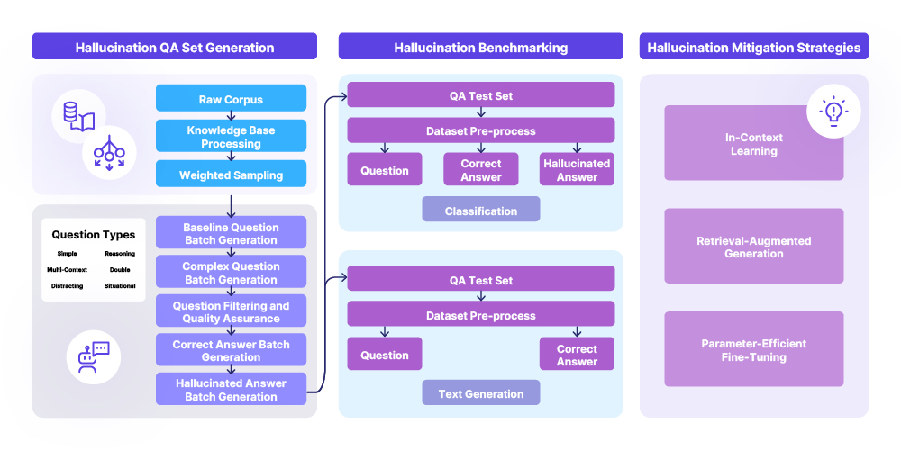

# THaMES Framework

<div align="center">

[](https://opensource.org/licenses/MIT)
</div>

This is the official implementation of the NeurIPS 2024 SOLAR Workshop Paper: THaMES: An End-to-End Tool for Hallucination Mitigation and Evaluation in Large Language Models. THaMES is a comprehensive framework for generating, mitigating, and evaluating hallucinations in Large Language Models (LLMs). The framework provides an end-to-end pipeline with support for:

- Ingesting various document formats (PDF, CSV, TXT, DOCX)
- Generating diverse question-answer pairs
- Evaluating model hallucination propensity
- Applying state-of-the-art mitigation strategies



## Installation

```shell
$ git clone https://github.com/Liangmf11/THaMES
$ cd THaMES
$ pip install -r requirements.txt
```

## Setup

In `.env`, set the following keys:

```env
OPENAI_API_KEY=<YOUR-OPENAI-API-KEY-HERE>
AZURE_OPENAI_ENDPOINT=<YOUR-OPENAI-API-ENDPOINT-HERE>
```

## Quick Start

The easiest way to use THaMES is through the unified pipeline interface:

```shell
# Run full pipeline with interactive prompts
$ poetry run python src/pipeline.py

# Run with specific arguments
$ poetry run python src/pipeline.py --categories 1,2 --question_types 1 2 3 --num_questions 10 --model_type azure --model_name gpt-4 --mitigation_techniques CoVe RAG --evaluation_type HALUEVAL
```

## Pipeline Components

THaMES consists of three main components that can be run independently as well:

### 1. Question-Answer Generation

```shell
$ poetry run python src/qa_pair_generator.py --categories 1,2 --filename academic_dataset --question-types 1,2,3 --num-questions 10 --hallucination y
```

### 2. Model Evaluation

```shell
# Evaluate with HaluEval
$ poetry run python src/evaluate_refactored.py --model_type azure --dataset ./output/final/academic_dataset --model_name gpt-4 --mitigation_techniques CoVe --evaluation_type HALUEVAL

# Evaluate with RAGAS
$ poetry run python src/evaluate_refactored.py --model_type ollama --dataset ./output/final/academic_dataset --model_name llama2 --mitigation_techniques RAG --evaluation_type RAGAS
```

## Features

### Document Processing

- Support for multiple document formats (PDF, CSV, TXT, DOCX)
- Automatic document categorization
- Batch processing capabilities

### Question Generation


Questions are broken down into the following categories:

- **Simple:** Basic questions that do not require complex reasoning or multiple contexts, with straight-forward answers directly contained in the knowledge base.
  
- **Reasoning:** Questions designed to enhance the need for reasoning to answer them effectively (at least one leap of intuition required to correlate the answer to the correct information from the knowledge base)
- Multi-Context: Questions that necessitate information from multiple related sections or chunks to formulate an answer.
  
- **Situational:** Questions including user context to evaluate the ability of the generation to produce relevant answer according to the context (first part of the question establishes some [correct OR distracting] context prior to the question itself)
  
- **Distracting:** Questions made to confuse the retrieval part of the RAG with a distracting element from the knowledge base but irrelevant to the question. (Designed to mess with embedding engines - leaves more reasoning work for the LLM)
  
- **Double:** Questions with two distinct parts to evaluate the capabilities of the query rewriter of the RAG
  
- **Conditional:** Questions that introduce a conditional element, adding complexity to the question.

#### Usage Notes

- Batch sizes and question counts are flexible, to be specified by the user or use standard defaults.
- The generator includes a quality filtering pipeline which flags various keywords as indicators of poor question quality, then recursively reevaluates flagged questions until the batch is no longer flagged.

### Hallucination Mitigation

#### Mitigation Strategies

- **Chain-of-Verification (CoVe)**: A technique that breaks down response generation into multiple verification steps, where each step validates the previous conclusions against the source material. [[paper]](https://arxiv.org/abs/2309.11495)

- **Retrieval-Augmented Generation (RAG)**: Enhances LLM responses by retrieving relevant context from a knowledge base (in this case, formed out of previously-incorrect/low-scoring questions) before generation, combining the model's parametric knowledge with non-parametric information retrieval. [[paper]](https://arxiv.org/abs/2005.11401)

- **Parameter-Efficient Fine-Tuning (PEFT)**: A method that adapts pre-trained models to specific tasks while updating only a small subset of parameters (updated based on a corpus of previously-incorrect questions), helping to maintain factual consistency. [[paper]](https://arxiv.org/abs/2403.14608)

### Evaluation Methods

- **Hallucination Identification**: Multiple-choice based evaluation method measuring factual consistency, relevance, and semantic accuracy of model outputs against reference documents, based on providing either a correct or incorrect Question-Answer pair and prompting the model to judge the accuracy of the pair. based on [[paper]](https://arxiv.org/abs/2305.11747)

- **Text Generation**: Answer-synthesis based evaluation framework based on multiple metrics including faithfulness, context relevancy, and answer relevancy, helping to quantify both retrieval quality and generation accuracy. based on [[paper]](https://arxiv.org/abs/2309.15217)

- **Per-category and aggregate metrics**: Detailed performance analysis broken down by question categories (Simple, Reasoning, Multi-Context, etc.) as well as overall system performance metrics including:
  - Faithfulness Score
  - Context Relevance
  - Answer Relevance
  - Response Coherence
  - Hallucination Rate

## Usage Modes

THaMES supports two usage modes:

### 1. Interactive Prompt Mode

```shell
$ poetry run python src/pipeline.py
```

Follow the interactive prompts to configure:

- Document categories
- Question types
- Model selection
- Mitigation strategies
- Evaluation methods

### 2. Argument Mode

```shell
$ poetry run python src/pipeline.py --categories 1,2 \
                        --question_types 1 2 3 \
                        --num_questions 10 \
                        --model_type azure \
                        --model_name gpt-4 \
                        --mitigation_techniques CoVe RAG \
                        --evaluation_type HALUEVAL
```

## Tutorials

Detailed tutorials will soon be available in the `tutorials/` directory including:

- Basic Pipeline Usage across all pathways
- Generating a basic testset
- Comparing Evaluation Results
- Understanding Model Performance

## Directory Structure

```shell
thames/
├── src/
│   ├── pipeline.py
│   ├── evaluate_refactored.py
│   └── qa_pair_generator.py
├── test_docs/
├── output/
│   └── final/
├── tutorials/
└── README.md
```

## License

THaMES is licensed under the MIT License - see [`LICENSE`](LICENSE) for more details.
